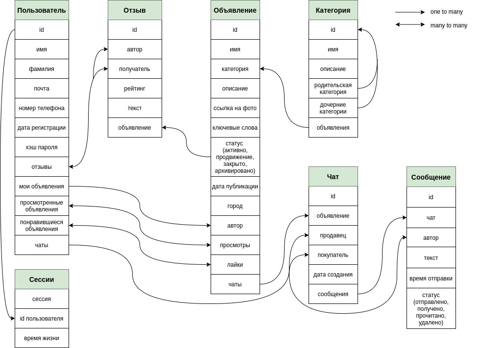

# Technopark-Highload
homework №2 at the course of the technopark highload

### 1. Выбор темы
Сервис для размещения объявлений

### 2. Определение возможного диапазона нагрузок

На 2020 год население России составляет 146,75 млн. По данным с [wiki](https://ru.wikipedia.org/wiki/%D0%AE%D0%BB%D0%B0_(%D1%81%D0%B5%D1%80%D0%B2%D0%B8%D1%81_%D0%BE%D0%B1%D1%8A%D1%8F%D0%B2%D0%BB%D0%B5%D0%BD%D0%B8%D0%B9)) ежемесячная аудитория на Юле составляет 27 млн уникальных пользователей в месяц, что составляет примерно 20% населения России. Всего у Юлы 90 млн. активных пользователей. Среднее значение RPS = 12 тыс.

Основные действия на сайте [Юла](https://youla.ru/):
* регистрация и авторизация
* работа с профилем
* просмотр, создание и редактирование объявлений
* список новых объявлений, поиск по ключевым словам и категориям
* чат
* лайки, отзывы

### 3. Выбор планируемой нагрузки

Исходя из приведенной статистики для Юлы определим возможный диапазон нагрузки на нашем сервисе следующим образом:
* составляет 40 млн. уникальных пользователей в месяц
* 120 млн. активных пользователей
* среднее значение RPS = 20 тыс.

### 4. Логическая схема базы данных

Выделим основные сущности в нашем проекте: пользователь, объявление, категория, отзыв, чат и сообщения. На рисунке отображены поля моделей и заданы отношения между каждой из моделей.

Стоит отдельно пояснить про механику взаимодействия между некоторыми моделями.
Так, например, "отзыв" имеет связь с "пользователем" и "объявлением", по причине того, что покупатель может оставить отзыв только после успешной покупки на нашем сервисе.
Модель "категория" наглядно представить в виде дерева, в котором родительские категории указывают на дочерние (например, животные -> кошки -> британская порода).
А связь "чат", "пользователь" и "объявление" установлена, потому что каждое объявление имеет уникальный чат с покупателем и продавцом, и создается в случае инициативы покупателя или постановки лайка.

### 5. Физическая системы хранения

Активные сессии пользователя будем хранить в redis. 
Высокая скорость работы Redis обеспечивается тем, что данные хранятся в оперативной памяти и сохраняются на диск либо через равные промежутки времени, 
либо при превышении определённого количества не сохранённых запросов. 
Из этого вытекает, что используя Redis, можно потерять результаты нескольких последних запросов, что вполне приемлемо для большинства веб-приложений, учитывая, что обращение к
Redis по скорости сравнимо с обращением к оперативной памяти. Тем не менее, потерь можно избежать через избыточность - Redis поддерживает неблокирующую master-slave репликацию.
Нагрузочное тестирование: 11 к. запросов SET в секунду, 81 к. запросов GET в секунду на Linux-сервере.

Данные о пользователе и активных объявлениях имеют для нас наибольший приоритет, потому что без них наше приложение потеряет ключевой функционал.
Для хранения этих данных я выбрал PostgreSQL, потому что по сравнению с другими реалиционными аналогами она имеет наиболее обширный функционал, эффективную репликацию и достаточно удобную поддержку.
Чтобы уместить все данные на одну машину используем технологию шардирования следующим образом: пользовательские данные, чаты и основные категории объявлений будут разделены по разным шардам.
Выделим основные категории объявлений для которых будет проводиться шардинг:
* одежда
* бытовая техника
* недвижимость
* автомобили
* прочее (животные, работа и.т.д.)

Исходя из собственных исследований контента на сервисах Авито и Юла, можно сделать вывод, 
что данные в приведенных пяти категориях будут занимать примерно равное количество места на диске (отклонение не больше 15%) и, как следствие, равномерно размазаны по шардам.

Для хранение изображений воспользуемся услугами облачного провайдера Amazon S3. Это решение является лучшим на рынке, так как оно рассчитано под хранение террабайтов данных, при этом имея высокую скорость и надежность. 
Чтобы оптимизировать работу с фотографиями будем хранить изображения пользователей и каждой категории объявлений в разных бакетах. 
Локацию фотографии для похода в нужный бакет для отдачи клиенту будем определять по урлу. 

### 6. Выбор прочих технологий

##### Языки программирования

Backend - Golang. Язык предоставляет эффективный параллелизм, такой как C, C ++, Java, в то же время параллелизм в Go осуществляется намного проще благодаря горутинам, каналам и сборке мусора. 
Он имеет об обширную стандартную библиотеку, а также утилиты для форматирования кода, тестирования и расчета покрытия прямо из коробки. 
В нем очень удобно построена интеграция с внешними зависимостями посредствам go.mod. Go быстрый, кроссплатформенный, open-source с относительно низким порогом вхождения.
Для работы с базой данных будем использовать фрейморк GORM. Для работы с протоколом http фреймворк роутер echo. 
Для работы с протоколом grpc стандартную библиотеку grpc-go. 

Frontend - HTML, CSS, TypeScript. Для  TypeScript будем использовать фреймворк React, который обеспечивает модульность, быстрый рендеринг, высокую run-time производительность. 
В сочетании с ES7 ReactTS может легко работать при высоких нагрузках. Также он имеет virtual DOM, которая позволяет упорядочивать документы форматов HTML, XHTML или XML в дерево, которое лучше всего подходит браузерам для анализа различных элементов веб-приложения.
	
##### Протоколы взаимодействия

Протокол связи между фронтендом и бэкендом - https, данные будут передаваться в формате json. 

Общение между микросервисами на бэкенде будет осуществляться по протоколу gRPC, данные будут передаваться в формате protobuf

##### Обеспечение качества

Как на фронтенде, так и на бэкенде будут использованы статические и динамические анализаторы кода, интеграционные и юнит тесты. 
Их запуск будет автоматизирован в Gitlab CI при открытии merge request в master.

##### Релиз процесс

Будем собирать rpm пакеты для наших сервисов. Каждый пакет будет иметь собственную уникальную версию. 
Сервисы будут деплоиться в kubernetes. Пайплайн раскладки в k8s будет состоять из нескольких этапов: dev, staging, prod, 
на каждом из которых можно убедиться в корректности работы сервиса, правильности заправленных хостов и.п.

Базы данных будут работать на "голом" железе, их конфиги будут доставляться по средствам puppet.

### 7. Расчет нагрузки и потребного оборудования

##### Активные сессии

Данный компонент архитектуры особо важен по той причине, что валидация cookie пользователей осуществляется на каждый запрос.
В среднем одна запись об активных сессиях может занимать до 30 байт. Количество запросов к ней можно сопоставить с общим rps на весь проект (макс. 40 тыс). 
Умножим это на 120 млн. активных пользователей получим итоговый объем занимаемых данных - 7.2 млрд. байт.

##### Пользователи

Одна запись пользователя в таблице занимает примерно 200 байт. Тогда общий объем занимаемой памяти составит 24 млрд. байт.
Количество запросов на запись может достигать 1 тыс. rps, на чтение 8 тыс. rps.

##### Объявления

Запись с одним объявлением может занимать до 900 байт. С учетом того, что у каждого пользователя может быть до 5 открытых объявлений получим, 
что максимальное количество объявлений может составить 600 млн. и тогда общий объем занимаемого места будет примерно равен 540 млрд. байт.
Количество запросов на запись может достигать 3 тыс. rps, на чтение 24 тыс. rps.

##### Фото

Если задать максимальный размер фотографии 500 кб. и под каждым объявлением разрешать размещать не более 10 фото 
(в расчетах считаем, что под каждым объявлением 10 фото), с учетом того, 
что у каждого пользователя есть аватарка и RPS на фото соизмерим с RPS на объявления, то получим 6.2 млрд. фотографий, что займет 360 трлн. байт.
 
##### Прочее

Сообщения, загрузка чатов и отзывы являются наименее редкими операциями в нашем веб-приложении, 
потому что большинство пользователей предпочитают связываться с покупателем по номеру телефона. 
Объем памяти на их хранение можно оценить примерно в 15 млрд. байт. 
Общее количество запросов может достигать 4 тыс. rps.

##### Микросервисы

Выделим основные микросервисы:
1. авторизация, регистрация, пользовательские данные
2. объявления
3. чаты

С учетом максимального размера данных, которые проходят через каждый из сервисов, 
и учитывая прочие накладные и алгоритмические расходы нам потребуется 146 гб., 830 гб., 70 гб. 
для первого, второго и третьего сервиса соответственно.

##### Расчет потребного оборудования

Исходя из приведенных выше данных нам потребуется 380 тб для полной функциональности нашего проекта, большую часть из которых (360 тб) занимают фото.
Поскольку мы будем хранить фото в амазоне мы можем не думать о закупке железа под них, а лишь выбрать нужный нам тариф. Для наших нужд нам хорошо подойдет S3 Standard.
Базы данных будут развернуты на голом железе. В то время как все остальные сервисы в k8s кластере. 
В таблице представлена конфигурация машин для каждого из узлов приложения с учетом реплицирования и ежегодного прироста данных.

| Узел | CPU (cores) | RAM (гб) | Диск SSD (тб) | Количество |
|:------:|:------:|:------:|:------:|:------:|
| Авторизация, регистрация, пользователи | 16 | 64 | 8 | 4 |
| Объявления | 32 | 128 | 16 | 15 |
| Чат | 8 | 32 | 2 | 3 |
| БД | 32 | 128 | 16 | 21 |
| Фротенд | 32 | 64 | 4 | 12 |
| Proxy перед S3 | 32 | 128 | 16 | 15 |

### 8. Выбор хостинга / облачного провайдера и расположения серверов

При покупке облачных серверов нет необходимости в аппаратной поддержке и найме сис. админов поэтому я решил смотреть в сторону облачных решений 
и в качестве провайдера выбрал MCS, потому что он предоставляет лучшие тарифы по метрике цена-качество по сравнению с конкурентами и обеспечивает весь нужный функционал:
 * поддержка kubernetes из коробки
 * быстрая миграция без остановки приложения
 * удобное масштабирование
 * оперативная тех. поддержка
 
Поскольку наша аудитория в первую очередь это Россия, то наши сервера будут раскиданы внутри страны по разным дата центам MRG, которые предоставляет MCS.

### 9. Схема балансировки нагрузки (входящего трафика и внутрипроектного, терминация SSL)

Будем использовать nginx для балансировки нагрузки с использованием схемы L7. 
Это позволит равномерно распределить нагрузку и решит проблемы медленных клиентов. 
Также nginx имеет внутренние инструменты для настройки SSL терминации. 
Nginx будет развернут и k8s, что обеспечит надежность при выходе из строя
и позволит динамически докидывать подов в случае сверхвысокой нагрузки на приложение. 

В k8s кластере при развертывании новой фермы на неё вешается отдельный vip, который также позволяет осуществлять балансировку по подам на уровне dns. 

### 10. Обеспечение отказоустойчивости

В нашей схеме есть четыре потенциальных узла, отказ которых приведет к полной или частичной деградации приложения:

* базы данных
* балансировщики 
* фронтенд
* микросервисы на бэкенде

Так как базы данных будут работать на железе и запросов на чтение в нашем сервисе приходит в разы больше чем, на изменение, 
то для обеспечения их отказоустойчивости будет резонно поднять для каждого мастера по два слейва на разных машинах в разных дата центрах, 
что повысит надежность данного компонента.
 
Отказоустойчивость всех наших микросервисов на бэкенде, балансировщиков и фронтенда обеспечивается за счет их развертки в k8s, 
так как внутри него можно настроить: автоматическую балансировка нагрузки с помощью постоянного мониторинга сведений о производительности и использовании ресурсов; 
грамотное размещение подов внутри кластера по дата центрам (правило affinity);
при падении любого пода по какой-либо причине запросы равномерно сбалансируются по оставшимся живым подам, до тех пор, пока k8s их не переподнимет.

Сам k8s кластер, на надежности которого держится большая часть системы будет грамотно развернут на многих машинах, размещенных в разных дата центрах находящихся в разных городах.

Для обеспечения надежного хранения данных в amazon s3, во-первых, как писалось выше, 
мы будем хранить различные фотографии в разных бакетах амазона, во-вторых, заведем отдельный резервный аккаунт. 
Также отдельно стоит отметить, что в выбранный нами тариф обслуживания (S3 Standard) входит пункт с договоренностью о предоставляемом SLA к нашим ресурсам. 

По-мимо всего прочего грамотно настроенные аллерты (на состояние машин, k8s кластера, всех ключевых микросервисов и бизнес процессов), подробная документация, CI/CD, 
всевозможные виды тестов (unit, интергационные, E2E, нагрузочные) 
и суточные дежурства внутри каждой из команд помогут вовремя среагировать на всевозможные экстраординарные ситуации.

Исходя из приведенных выше рассуждений можно сделать вывод, что падение какого-то одного узла, пода, машины 
или даже дата центра не приведет к полной деградации нашего проекта.
